# 플러스 주차 개인 과제

## 🛠 사용 기술
| 분야             | 기술 스택                                                                       |
| -------------- |-----------------------------------------------------------------------------|
| **Language**   | Java 17                                                                     |
| **Build Tool** | Gradle 8.10                                                                 |
| **Framework**  | Spring Boot 3.5.0, Spring Data JPA (Hibernate 6.5.2.Final), Spring Security |
| **Database**   | MySQL 8.0+                                                     |
| **ORM**        | JPA, QueryDSL 5.1.0                                                         |
| **Infra**      | Docker, AWS EC2, RDS (MySQL), S3 (이미지 업로드)                                  |
| **CI/CD**      | GitHub Actions                                                              |
| **Testing**    | JUnit5, Spring Boot Test                                                    |

 

## 📝 단계별 요구사항
`필수 기능`
- Level. 1
  1. 코드 개선 퀴즈 - @Transactional의 이해
  2. 코드 추가 퀴즈 - JWT의 이해
  3. 코드 개선 퀴즈 -  JPA의 이해
  4. 테스트 코드 퀴즈 - 컨트롤러 테스트의 이해
  5. 코드 개선 퀴즈 - AOP의 이해
- Level. 2
  6. JPA Cascade
  7. N+1
  8. QueryDSL
  9. Spring Security

`도전 기능`
- Level. 3
  10. QueryDSL 을 사용하여 검색 기능 만들기
  11. Transaction 심화
  12. AWS 활용
  13. 대용량 데이터 처리

 

## AWS 인프라 구성 요약

### EC2
- 탄력적 IP: `3.34.211.143`
- 보안 그룹: `8080`, `22`, `80`, `443` 허용
- [✔️] health check API: [http://3.34.211.143:8080/health](http://3.34.211.143:8080/health)

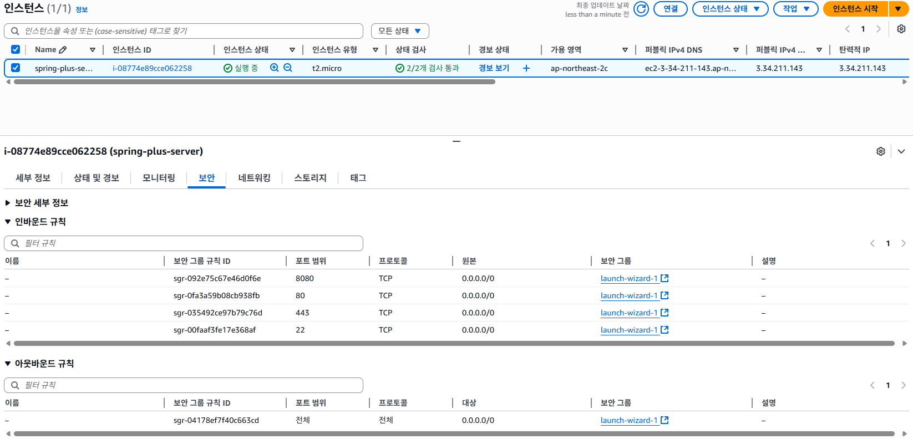
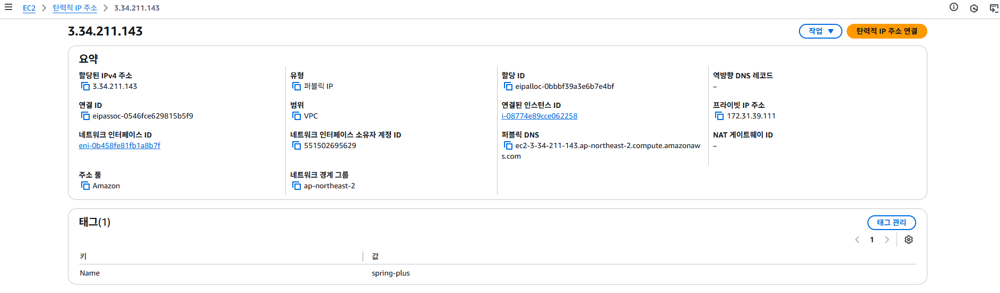

 

### RDS
- 엔드포인트: `db-mysql.cn8464wg8v6z.ap-northeast-2.rds.amazonaws.com`
- MySQL 8.0 / 포트 3306
- EC2에서 연결 허용

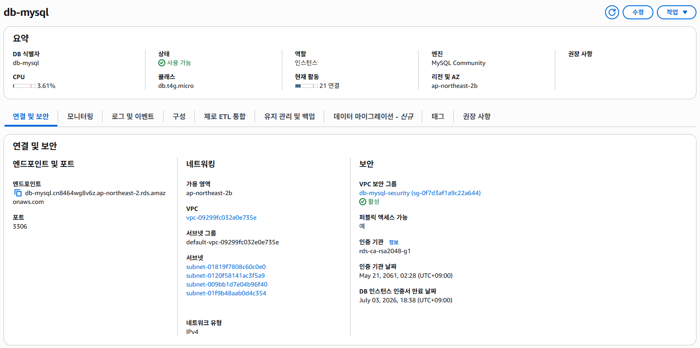

 

### S3
- 버킷 이름: `gajicoding-spring-bucket`
- 프로필 이미지 수정 API:
    - `POST /users/profile-image`

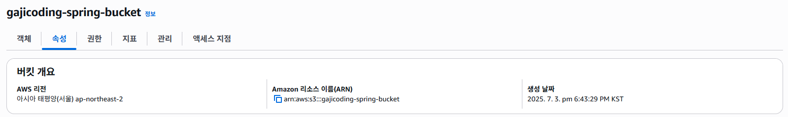

 
 

## 대용량 데이터 처리
- 데이터 준비

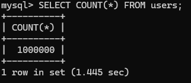

 

- 개선 전

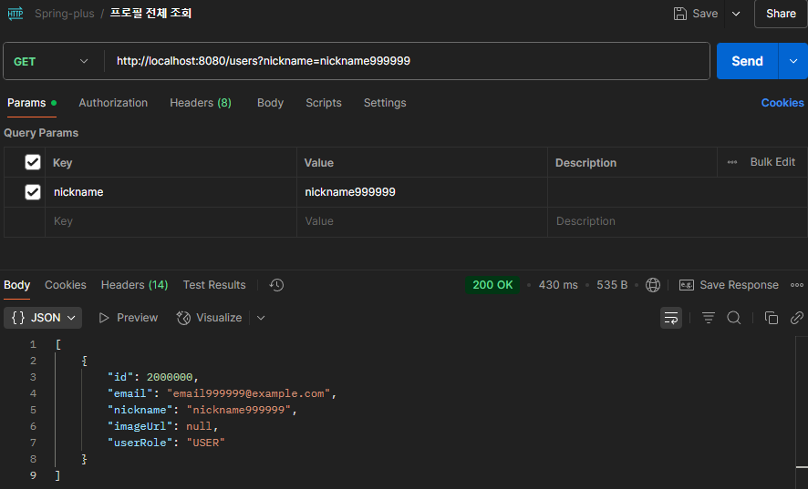
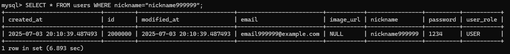
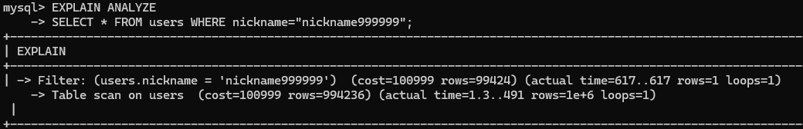

 

- INDEX 적용

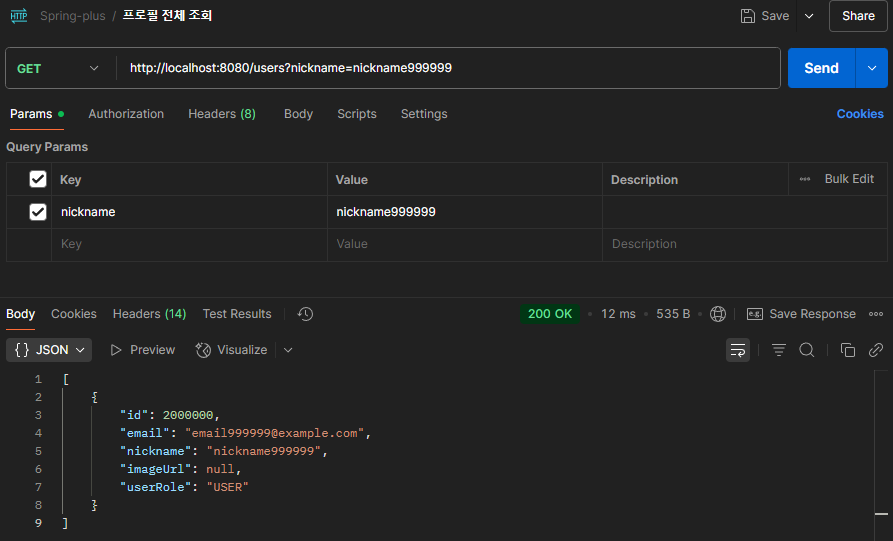
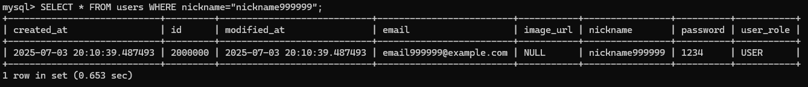
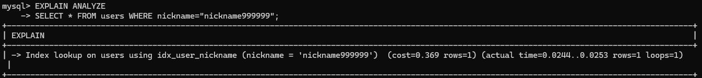

 

- Projection 최적화 + Covering Index 사용

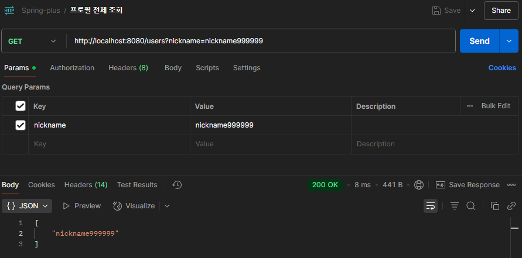
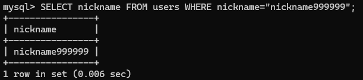
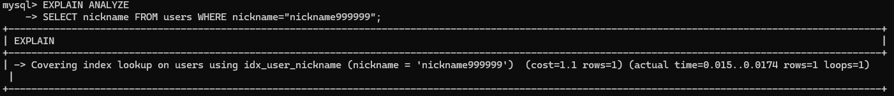

🔍 새로운 지식
